# Testla CLI

Gesamtbild: Ich möchte jeden End-to-End-Test den ich von Hand schreibe durch AI erstellen lassen.
Das bedeutet: Jira-Ticket/Prompt lesen bzw. verstehen, die App erkunden, herausfinden, was getestet
werden muss, den testla-screenplay-playwright Code schreiben, ihn debuggen, wenn er fehlschlägt,
wiederholen.

→ Zu wissen, wann man NICHT korrigieren sollte, ist genauso wichtig wie das Korrigieren selbst. Der
Runner-Agent unterscheidet zwischen App-Fehlern und Testfehlern und weigert sich, fehlerhaftes
Produktverhalten durch Anpassung des Tests zu verschleiern.

Da ich das ganze mit lokalen ollama modellen (qwen3-coder) abbilden möchte müssen es mehrere Agents
sein, die sehr konkret bzw. konkrete Aufgaben erhalten, damit diese nicht halluzinieren.

qwen3-coder

## Structure

```sh
testla-cli/
├── main.ts                    ← CLI-Entrypoint (testla setup | run)
├── deno.json
└── src/
    ├── config.ts              ← ~/.testla/config.json lesen/schreiben
    ├── commands/
    │   ├── setup.ts           ← Interaktives Setup mit Verbindungstest
    │   └── run.ts             ← Orchestriert Input → Analyst → .toon-Datei
    ├── agents/
    │   └── analyst.ts         ← Der Analyst-Agent mit TOON-System-Prompt
    └── clients/
        ├── ollama.ts          ← Ollama HTTP-Client (mit Streaming)
        └── jira.ts            ← Jira REST-Client + ADF→Text Parser
```

## Agent-Pipeline

```sh
[Input: Jira-Ticket / Prompt]
         ↓
  Agent 1: Analyst
         ↓
  Agent 2: App Explorer
         ↓
  Agent 3: Test Architect
         ↓
  Agent 4: Code Writer
         ↓
  Agent 5: Runner & Debugger  ←─────────────┐
         ↓                                  │
  Agent 6: Verdict (App-Bug vs. Test-Bug) ──┘
         ↓
  [Output: fertiger Test oder Bug-Report]
```

## Agent - Analyst

Konkrete, isolierte Aufgabe: Jira-Ticket / freien Prompt lesen → strukturierten Test-Brief als JSON
ausgeben. Der Agent bekommt nur Text rein und gibt nur strukturiertes JSON raus — kein Playwright,
kein Browser, keine Seiteneffekte. Das ist genau die Art von enger, deterministischer Aufgabe, bei
der qwen3-coder nicht halluziniert.

Agent Analyst Output — Test-Brief als TOON So würde das aussehen, wenn der Analyst Agent ein
Jira-Ticket verarbeitet:

```sh
toonfeature: Checkout flow
goal: Nutzer kann Produkt kaufen und Bestätigung erhalten
entry_point: unknown
preconditions[2]: Nutzer ist eingeloggt,Produkt ist im Warenkorb

scenarios[2]{id,name,type,expected_outcome}:
  TC-01,Erfolgreicher Kauf,happy_path,Bestätigungsseite mit Bestellnummer
  TC-02,Ungültige Kreditkarte,edge_case,Fehlermeldung wird angezeigt

steps:
  TC-01[4]: Warenkorb öffnen,Checkout klicken,Adresse eingeben,Zahlung bestätigen
  TC-02[3]: Warenkorb öffnen,Checkout klicken,Ungültige Kartennummer eingeben

out_of_scope[2]: Zahlungsanbieter-Internals,Email-Versand
open_questions[2]: Welche URL ist der Entry-Point?,Gibt es Testdaten/Fixtures?
```

Was der Analyst Agent konkret bekommt und liefert Input (einer von zwei Wegen):

```sh
testla run --ticket PROJ-123 → Jira REST API call → Ticket-Text
testla run --prompt "Teste den Login-Flow mit falschen Credentials" → direkter Text
```

Aufgabe des LLM-Calls (enger Scope = weniger Halluzination):

"Lies dieses Ticket/diesen Prompt. Extrahiere Testszenarien. Gib ausschließlich TOON aus. Keine
Erklärungen, kein Markdown drumherum."

Output: .toon Datei auf Disk (oder stdout) → wird von Agent 2 als Input gelesen

Wichtige Design-Entscheidung für den Prompt Da qwen3-coder ein lokales Modell ist, braucht der
System-Prompt für den Analyst Agent ein konkretes TOON-Beispiel direkt im Prompt — das Modell sieht
das Muster und wiederholt es, statt es zu erfinden. Die TOON-Doku selbst sagt: "show the format
instead of describing it".

## Architektur



## Command Overview

```sh
testla setup # Global Setup → Ollama → APP-URL → Jira optional → ~/.testla/config.json

testla init # Project-Specific setup wie Base-URL. → ~/.testla/config.json

testla run --ticket PROJ-42 # Jira → formatTicket → Analyst → .testla/briefs/PROJ-123.toon
testla run --prompt "Test login..." # direkt → Analyst → .testla/briefs/run-<timestamp>.toon

testla dashboard # oder: testla dash
```
